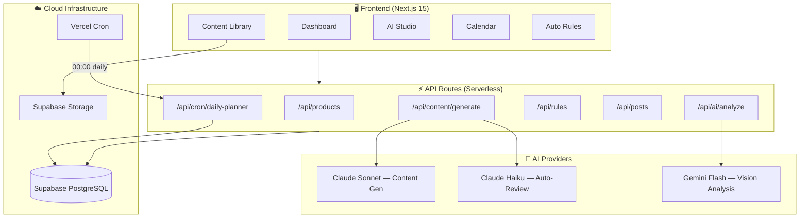

# 🚀 AI Marketing Center (AMC)

> **"Upload 1 ảnh → AI tạo content đa kênh + tự lên lịch đăng bài hàng ngày"**

Nền tảng SaaS tự động hóa marketing bằng AI, tích hợp **Claude 3.5** (Anthropic) và **Gemini 1.5** (Google) để phân tích sản phẩm, sinh nội dung đa kênh và lên lịch đăng bài tự động trên Facebook, Instagram, TikTok.

---

## 📐 Kiến trúc Hệ thống



### Tech Stack

| Layer | Công nghệ | Vai trò |
|-------|-----------|---------|
| **Framework** | Next.js 15 (App Router) | Fullstack: UI + API Routes |
| **Database** | Supabase PostgreSQL | Multi-tenant, RLS enabled |
| **Storage** | Supabase Storage | Upload ảnh sản phẩm |
| **Auth** | Supabase Auth | *(Planned)* |
| **AI Content** | Anthropic Claude 3.5 Sonnet | Sinh caption marketing |
| **AI Review** | Anthropic Claude 3.5 Haiku | Tự chấm điểm chất lượng |
| **AI Vision** | Google Gemini 1.5 Flash | Phân tích hình ảnh sản phẩm |
| **Hosting** | Vercel | Serverless deploy + Cron jobs |
| **CSS** | Vanilla CSS | Dark Glassmorphism theme |

---

## ✨ Chức năng (Features)

### 📊 Dashboard
Tổng quan realtime: số sản phẩm, rules, bài đã tạo, bài đã đăng.

### 📦 Content Library
- CRUD sản phẩm (tên, mô tả, USP, giá, hạng mục)
- Upload ảnh lên Supabase Storage
- AI Vision tự trích xuất đặc điểm sản phẩm

### 🎨 AI Studio ⭐
Luồng chính của hệ thống:
1. **Chọn sản phẩm** từ thư viện
2. **Chọn nền tảng** (Facebook, Instagram, TikTok, LinkedIn)
3. **Chọn góc nội dung** (Giới thiệu, Khuyến mãi, Viral, Kiến thức)
4. **Claude Sonnet** sinh caption + hashtags tối ưu
5. **Claude Haiku** chấm điểm 0-10 + gợi ý cải thiện
6. Lưu bản nháp vào DB → sẵn sàng duyệt hoặc lên lịch

### 📅 Calendar
- Hiển thị posts dạng Timeline
- Duyệt (Approve) / Hủy (Delete) bài nháp AI tạo

### ⚙️ Auto Rules Engine
- Quy tắc tự động: "Thứ 2-4-6 lúc 08:00 đăng bài Tips lên Facebook"
- Bật/Tắt rules ngay trên UI
- **Vercel Cron** chạy hàng đêm tự tạo content cho ngày mai

### 🔗 Social Accounts *(Coming Soon)*
- Kết nối Facebook, Instagram, TikTok

### 📈 Analytics *(Coming Soon)*
- Reach, Engagement, Conversion reports

---

## 🗄️ Database Schema (10 tables)

```mermaid
erDiagram
    tenants ||--o{ users : has
    tenants ||--o{ products : has
    tenants ||--o{ brand_settings : has
    tenants ||--o{ schedule_rules : has
    tenants ||--o{ posts : has
    tenants ||--o{ social_accounts : has
    products ||--o{ posts : "published from"
    products ||--o{ generated_contents : "AI drafts"
    posts ||--o| post_analytics : metrics

    tenants {
        text id PK
        text name
        text slug UK
        text plan
    }

    products {
        text id PK
        text name
        text description
        float8 price
        text category
        text usp
        jsonb images
        jsonb ai_analysis
        timestamptz last_posted_at
        text tenant_id FK
    }

    brand_settings {
        text id PK
        text tenant_id FK_UK
        text brand_name
        text brand_voice
        jsonb colors
        jsonb hashtags
        text logo_url
    }

    schedule_rules {
        text id PK
        text name
        text time
        text platform
        text content_type
        jsonb days_of_week
        text rotation
        boolean is_active
        text tenant_id FK
    }

    posts {
        text id PK
        text product_id FK
        text platform
        text caption
        jsonb image_urls
        timestamptz scheduled_at
        timestamptz published_at
        text status
        text external_id
        text tenant_id FK
    }

    generated_contents {
        text id PK
        text product_id FK
        text platform
        text caption
        text hashtags
        jsonb image_urls
        float8 ai_score
        text status
        text tenant_id FK
    }

    post_analytics {
        text id PK
        text post_id FK_UK
        int4 likes
        int4 comments
        int4 shares
        int4 reach
        float8 engagement
    }
```

> Tất cả tables đều có **RLS (Row Level Security)** enabled. Dữ liệu được cách ly theo `tenant_id`.

---

## 📂 Cấu trúc thư mục

```
📦 src/
 ┣ 📂 app/
 ┃ ┣ 📂 api/
 ┃ ┃ ┣ 📂 ai/analyze/           # POST — Gemini Vision
 ┃ ┃ ┣ 📂 content/generate/     # POST — Claude AI pipeline
 ┃ ┃ ┣ 📂 cron/daily-planner/   # POST — Vercel Cron trigger
 ┃ ┃ ┣ 📂 posts/[id]/           # PATCH, DELETE
 ┃ ┃ ┣ 📂 products/             # GET, POST
 ┃ ┃ ┃ ┗ 📂 [id]/               # PATCH, DELETE
 ┃ ┃ ┗ 📂 rules/                # GET, POST
 ┃ ┃   ┗ 📂 [id]/               # PATCH, DELETE
 ┃ ┣ 📂 accounts/               # Social Accounts UI
 ┃ ┣ 📂 analytics/              # Analytics UI
 ┃ ┣ 📂 calendar/               # Calendar + CalendarClient
 ┃ ┣ 📂 library/                # Library + LibraryClient
 ┃ ┣ 📂 rules/                  # Rules + RulesClient
 ┃ ┣ 📂 studio/                 # Studio + StudioClient
 ┃ ┣ 📜 globals.css             # Design System
 ┃ ┣ 📜 layout.tsx              # Root layout
 ┃ ┣ 📜 loading.tsx             # Global loading spinner
 ┃ ┗ 📜 page.tsx                # Dashboard
 ┣ 📂 components/
 ┃ ┣ 📜 AddProductModal.tsx     # Modal thêm sản phẩm
 ┃ ┣ 📜 DashboardLayout.tsx     # Layout wrapper
 ┃ ┗ 📜 Sidebar.tsx             # Navigation (client)
 ┗ 📂 lib/
   ┣ 📂 ai/
   ┃ ┣ 📜 claude.ts             # generateContent + reviewContent
   ┃ ┗ 📜 gemini.ts             # analyzeProductImage
   ┣ 📂 supabase/
   ┃ ┣ 📜 client.ts             # Browser client (anon key)
   ┃ ┗ 📜 server.ts             # Server client + Admin client
   ┗ 📜 data.ts                 # Data fetching helpers
```

---

## 🔌 API Reference

### Core AI

| Method | Endpoint | Mô tả | Body |
|--------|----------|-------|------|
| `POST` | `/api/content/generate` | AI sinh content đa kênh | `{ productId, platforms[], contentType }` |
| `POST` | `/api/ai/analyze` | Gemini Vision phân tích ảnh | `{ imageUrl }` |

### CRUD

| Method | Endpoint | Mô tả |
|--------|----------|-------|
| `GET` | `/api/products` | Lấy danh sách sản phẩm |
| `POST` | `/api/products` | Thêm sản phẩm mới |
| `PATCH` | `/api/products/:id` | Cập nhật sản phẩm |
| `DELETE` | `/api/products/:id` | Xóa sản phẩm |
| `GET` | `/api/rules` | Lấy danh sách rules |
| `POST` | `/api/rules` | Thêm rule |
| `PATCH` | `/api/rules/:id` | Cập nhật / toggle rule |
| `DELETE` | `/api/rules/:id` | Xóa rule |
| `PATCH` | `/api/posts/:id` | Duyệt / sửa bài |
| `DELETE` | `/api/posts/:id` | Hủy bài |

### Automation

| Method | Endpoint | Trigger | Auth |
|--------|----------|---------|------|
| `POST` | `/api/cron/daily-planner` | Vercel Cron 00:00 daily | `Bearer CRON_SECRET` |

---

## 🛠 Getting Started

### 1. Clone & Install

```bash
git clone <repo-url>
cd biathaytu
npm install
```

### 2. Cấu hình Environment

Tạo file `.env.local`:

```env
# Supabase (Bắt buộc)
NEXT_PUBLIC_SUPABASE_URL=https://xxx.supabase.co
NEXT_PUBLIC_SUPABASE_ANON_KEY=eyJ...
SUPABASE_SERVICE_ROLE_KEY=eyJ...

# AI APIs (Cần để chạy AI Studio)
ANTHROPIC_API_KEY=sk-ant-...
GOOGLE_AI_API_KEY=AIza...

# Cron Job Auth
CRON_SECRET=your-secret-here
```

### 3. Chạy Dev

```bash
npm run dev
# → http://localhost:3000
```

### 4. Deploy lên Vercel

```bash
# Vercel sẽ tự detect Next.js
vercel --prod

# Cấu hình env vars trong Vercel Dashboard
# Cron job sẽ tự chạy theo vercel.json
```

---

## 🗺 Roadmap

- [x] Dashboard + Content Library
- [x] AI Studio (Claude + Gemini pipeline)
- [x] Calendar (Post approval workflow)
- [x] Auto Rules Engine + Cron
- [ ] Social OAuth (Facebook Graph API, IG, TikTok)
- [ ] Auto Publishing (đăng bài tự động)
- [ ] Analytics Dashboard (Engagement metrics)
- [ ] AI Image Generation (Nano Banana)
- [ ] MCP Server (expose tools cho AI agents khác)
- [ ] Multi-tenant onboarding + RBAC

---

## 📝 License

Private — Internal use only.
