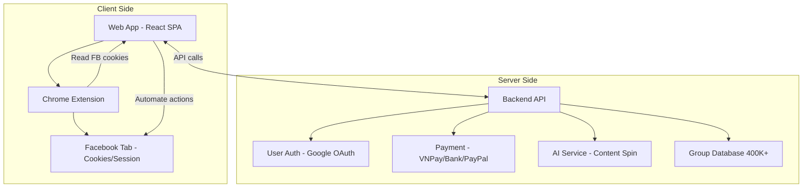

# 🔍 Nghiên Cứu FBTool.net — Phân Tích & Đánh Giá Khả Thi

## 1. FBTool Là Gì?

**FBTool.net** là công cụ **tự động hoá marketing trên Facebook**, giúp đăng bài hàng loạt vào nhiều nhóm Facebook cùng lúc. Tool hoạt động qua **Web App + Chrome Extension** — extension đọc cookies/session Facebook từ trình duyệt, web app điều khiển automation.

**Thuộc hệ sinh thái 1Man.io** (cùng creator: GiangDDT), bao gồm:

| Tool | Nền tảng | Domain |
|------|----------|--------|
| FBTool | Facebook | fbtool.net |
| ToptopTool | TikTok | toptoptool.net |
| ZaloTool | Zalo | zalotool.net |
| MailingTool | Gmail | mailingtool.net |
| Uptin | AI Marketing tổng hợp | uptin.vn |
| 1Man.io | Platform chung | 1man.io |

> [!NOTE]
> Tất cả đều dùng **chung 1 codebase React**, chỉ thay đổi metadata theo hostname.

---

## 2. Tính Năng Chi Tiết

### 🔥 Core Features (17 tính năng)

| # | Tính năng | Mô tả | Gói |
|---|-----------|-------|-----|
| 1 | **Đăng bài thường** | Soạn content + ảnh/video, chọn nhóm, đăng tự động | BASIC |
| 2 | **Đăng lần lượt** | 10 bài khác nhau, đăng tuần tự vào từng nhóm | PLUS |
| 3 | **Đăng kèm bình luận** | Đăng bài + auto comment vào bài vừa đăng | PLUS |
| 4 | **Đăng song song** | Bài 1→Nhóm 1, Bài 2→Nhóm 2... phân phối đều | PLUS |
| 5 | **Đăng chéo** | Share/cross-post bài từ nhóm này sang nhóm khác | PLUS |
| 6 | **Úp bài (Bump)** | Comment vào bài cũ để đẩy lên top feed | BASIC |
| 7 | **Bình luận dạo** | Auto comment vào bài mới nhất của nhóm | BASIC |
| 8 | **AI Spin** | AI viết lại nội dung mỗi lần đăng → tránh spam | BASIC |
| 9 | **Tìm kiếm & Bộ sưu tập** | Tìm nhóm, lưu preset nhóm hay đăng | BASIC |
| 10 | **Lịch sử bài đã đăng** | Chọn nhanh bài cũ để đăng lại | BASIC |
| 11 | **Chia sẻ link** | Share link (livestream, reels, tiktok) vào nhóm | BASIC |
| 12 | **Đăng có phông nền** | Dùng background màu cho bài text ngắn | BASIC |
| 13 | **Đăng video** | Upload MP4 đăng vào nhóm | BASIC |
| 14 | **Xoá bài hàng loạt** | Xóa bài chờ duyệt/đã đăng theo nhóm | BASIC |
| 15 | **Tag @Mọi người** | Auto tag/nêu bật khi đăng bài | PRO |
| 16 | **Tắt Marketplace** | Không đẩy bài mua/bán lên Marketplace | BASIC |
| 17 | **Xáo trộn ảnh** | Đổi thứ tự ảnh mỗi lần đăng → tránh duplicate | BASIC |

### 🛡️ Tính Năng Ẩn (Anti-spam)

- Auto chậm lại khi Facebook cảnh báo
- Auto dừng khi dính spam (5 lần fail liên tục)
- Auto né Checkpoint sau lần đầu
- **Cài đặt delay** giữa các bài: 60-120 giây (tuỳ chỉnh)
- Toggle **"Né spam"** on/off

### 🤖 Tính Năng Cao Cấp (Gói MAX — 1tr/tháng)

- **AI tìm khách hàng** từ bài quảng cáo, bài yêu thích, hội nhóm
- **Lọc & tương tác** bạn bè/người theo dõi
- **Phê duyệt thành viên** nhóm tự động
- **Tham gia nhóm** hàng loạt (database 400K+ nhóm)

---

## 3. Kiến Trúc Kỹ Thuật

### Cách hoạt động:

1. **Chrome Extension** đọc cookies/session Facebook từ tab FB đang mở
2. **Web App** nhận session → gọi Facebook API (unofficial) qua browser context
3. **Automation** thực hiện đăng bài bằng cách simulate hành vi user trên Facebook
4. **AI Spin** gọi API backend để rewrite content trước mỗi lần đăng
5. **Anti-spam logic** chạy client-side, detect lỗi và auto-adjust

### Tech Stack (phân tích từ source):
- **Frontend**: React (create-react-app), Public Sans + Roboto fonts
- **Hosting**: Cloudflare (CDN + Analytics)
- **Extension**: Chrome Manifest V2/V3
- **AI**: Google Cloud AI (gen-app-builder)
- **Auth**: Google OAuth
- **Docs**: GitBook

---

## 4. Bảng Giá

| Gói | Tháng | Năm | Tính năng chính |
|-----|-------|-----|-----------------|
| **BASIC** | 100K VNĐ | 600K | Đăng bài + AI Spin + Bình luận dạo |
| **PLUS** | 200K VNĐ | 1.2M | + Đăng lần lượt/song song/chéo + Comment kèm |
| **PRO** | 400K VNĐ | 2.4M | + Tag @mọi người + Lọc bạn bè + Duyệt TV |
| **MAX** | 1M VNĐ | 6M | + AI tìm khách hàng + Full features |

**Referral**: 20% hoa hồng vĩnh viễn khi giới thiệu người mới.

---

## 5. Đánh Giá Khả Thi — Có Thể Làm Tool Tương Tự Không?

### ✅ CÓ THỂ LÀM ĐƯỢC

Về mặt kỹ thuật, hoàn toàn khả thi. Dưới đây là phân tích chi tiết:

---

### Phương Án A: Web App + Chrome Extension (Giống FBTool)

> **Mô hình**: Extension đọc session FB → Web app điều khiển automation

| Thành phần | Công nghệ đề xuất | Effort |
|------------|-------------------|--------|
| Web App (Dashboard) | Next.js / Vite + React | 2-3 tuần |
| Chrome Extension | Manifest V3, Content Scripts | 1-2 tuần |
| Backend API | Supabase (đã có) / FastAPI | 1 tuần |
| AI Spin Content | Gemini API / DeepSeek | 2-3 ngày |
| Payment | VNPay / Banking QR | 3-5 ngày |
| Group Database | Crawl + Supabase storage | 1 tuần |
| Anti-spam Logic | Client-side heuristics | 3-5 ngày |
| Auth | Google OAuth (Supabase Auth) | 1 ngày |

**Tổng estimate**: ~5-7 tuần cho MVP

| Ưu điểm | Nhược điểm |
|---------|------------|
| Giống mô hình đã được chứng minh | Vi phạm ToS Facebook |
| Không cần server nặng | Extension cần cập nhật liên tục |
| User quen với flow này | Facebook thay đổi DOM → tool bể |
| Chi phí vận hành thấp | Rủi ro bị Google/Chrome gỡ extension |

---

### Phương Án B: Full Server-side Automation (Browser Automation)

> **Mô hình**: Server chạy Puppeteer/Playwright điều khiển browser headless

| Ưu điểm | Nhược điểm |
|---------|------------|
| User không cần cài extension | Chi phí server rất cao |
| Kiểm soát tốt hơn | Scaling khó (mỗi user = 1 browser instance) |
| Ít phụ thuộc DOM thay đổi | Cần proxy xoay → tốn thêm chi phí |
| | Dễ bị Facebook detect & block |

---

### Phương Án C: Facebook Graph API (Chính thống)

> **Mô hình**: Dùng Facebook Official API

| Ưu điểm | Nhược điểm |
|---------|------------|
| Hợp pháp, không vi phạm ToS | Không thể đăng bài vào Group |
| Ổn định, không bị break | API bị giới hạn rất nặng |
| | Cần Facebook App Review → rất khó thông qua |

> [!CAUTION]
> **Facebook Graph API KHÔNG cho phép đăng bài vào Groups qua API từ năm 2018.** Phương án này không khả thi cho use case chính của FBTool.

---

## 6. Khuyến Nghị

### ✅ Khuyến nghị: Phương Án A (Web App + Chrome Extension)

**Lý do:**
1. **Mô hình đã proven** — FBTool đang kinh doanh thành công với cách này
2. **Chi phí thấp** — không cần server chạy browser, logic chạy client-side
3. **Stack phù hợp** — React (đã thạo), Supabase (đã có), Chrome Extension (straightforward)
4. **MVP nhanh** — 5-7 tuần, có thể ra sản phẩm tối thiểu trong 3-4 tuần

### 🎯 Cách tạo khác biệt so với FBTool

| Khác biệt | Chi tiết |
|-----------|---------|
| **AI Content** nâng cao | Dùng Gemini 2.5 để viết content chuẩn SEO thay vì chỉ spin |
| **Analytics Dashboard** | Tracking hiệu quả bài đăng (reach, engagement) |
| **Multi-platform** | Mở rộng sang Zalo, TikTok, LinkedIn từ đầu |
| **Scheduling** | Đặt lịch đăng bài tự động |
| **Team Management** | Nhiều người dùng chung, phân quyền |
| **Template Library** | Kho mẫu content theo ngành |

---

## 7. Rủi Ro Cần Lưu Ý

> [!WARNING]
> ### Rủi ro pháp lý & kỹ thuật
> 
> 1. **Vi phạm ToS Facebook** — Tool dạng này vi phạm điều khoản sử dụng Facebook. Tài khoản user có thể bị khóa.
> 2. **Chrome Web Store** có thể reject extension nếu phát hiện automation Facebook
> 3. **Facebook DOM thay đổi** → cần team maintain liên tục
> 4. **Cạnh tranh** — Thị trường đã có nhiều tool (FBTool, ATP, Simple Facebook, HeroTool...)
> 5. **Liability** — Nếu user bị khóa account, có thể đổ lỗi cho tool

---

## 8. Câu Hỏi Cần Anh Trả Lời

Trước khi quyết định triển khai, tôi cần biết:

1. **Mục đích sử dụng?** 
   - Dùng cho cá nhân / cho SENAI marketing?
   - Hay muốn build sản phẩm SaaS kinh doanh riêng?

2. **Scope MVP muốn làm?**
   - Chỉ đăng bài vào nhóm FB? (1-2 tuần)
   - Hay full features giống FBTool? (5-7 tuần)

3. **Platform nào?**
   - Chỉ Facebook?
   - Hay cần cả Zalo/TikTok/LinkedIn?

4. **Budget server/hosting?**
   - Dùng Supabase hiện tại hay cần tách riêng?

5. **Có chấp nhận rủi ro ToS?**
   - Automation Facebook luôn có rủi ro bị khóa account

---

*Nghiên cứu bởi SENAI Agent — 11/04/2026*
